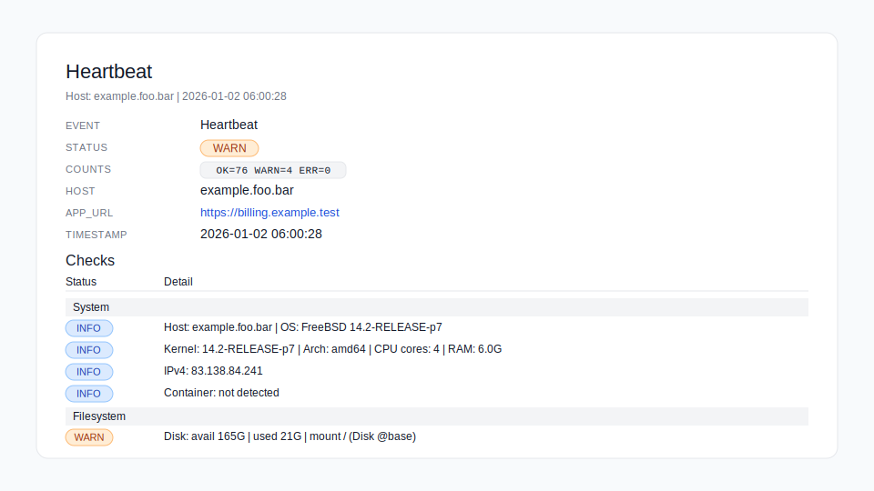

# INmanage Documentation

INmanage is the CLI for self-hosted Invoice Ninja. Focus: **convenience**, **certainty**, **low stress**. This document keeps the flow simple while staying complete.

## Table of contents

- **INmanage (CLI)**
  - [Project layout (INmanage)](#project-layout-inmanage)
  - [Invoice Ninja CLI](#invoice-ninja-cli)
  - [First run (CLI)](#first-run-cli)
  - [Global switches (CLI)](#global-switches-cli)
  - [Files and permissions](#files-and-permissions)
  - [Hooks (CLI pre/post)](#hooks-cli-prepost)
  - [Uninstall and reinstall CLI](#uninstall-and-reinstall-cli)
  - [Health checks (INmanage)](#health-checks-inmanage)
  - [Cron jobs (INmanage)](#cron-jobs-inmanage)
  - [Heartbeat notifications (INmanage)](#heartbeat-notifications-inmanage)
  - [Environment helper (CLI/App)](#environment-helper-cliapp)
  - [CLI config reference (.env.inmanage)](#cli-config-reference-envinmanage)
  - [Cache and downloads (INmanage)](#cache-and-downloads-inmanage)
  - [Database client selection (INmanage)](#database-client-selection-inmanage)
  - [MySQL client config (.my.cnf) (INmanage)](#mysql-client-config-mycnf-inmanage)
  - [Debugging (INmanage)](#debugging-inmanage)
  - [Sudo usage (INmanage)](#sudo-usage-inmanage)
  - [FAQ (INmanage)](#faq-inmanage)
  - [Troubleshooting (short, INmanage)](#troubleshooting-short-inmanage)
  - [CLI help (SSOT, INmanage)](#cli-help-ssot-inmanage)
- **Invoice Ninja (App)**
  - [Install Invoice Ninja](#install-invoice-ninja)
  - [Update Invoice Ninja](#update-invoice-ninja)
  - [Backup Invoice Ninja](#backup-invoice-ninja)
  - [Restore Invoice Ninja](#restore-invoice-ninja)
  - [Rollback cheatsheet (INmanage)](#rollback-cheatsheet-inmanage)
  - [libSaxon (XSLT2) for e‑invoicing (Invoice Ninja)](#libsaxon-xslt2-for-einvoicing-invoice-ninja)
- **Environments**
  - [Containers \& VMs onboarding (Invoice Ninja and INmanage)](#containers--vms-onboarding-invoice-ninja-and-inmanage)
  - [Recipes \& Tutorials (Environments)](#recipes--tutorials-environments)
- **Other**
  - [Licensing](#licensing)

## Project layout (INmanage)

This is the map of folders and files INmanage expects.

- **Base directory**: the folder that contains your Invoice Ninja app folder (or will contain it).
- **Install directory**: the app folder itself (default: `./invoiceninja`).
- **CLI config** lives in `.inmanage/` next to your app, not inside it.

Key files:
- `.inmanage/.env.inmanage` — CLI config (generated on first run)
- `.inmanage/.env.provision` — provisioned install config (unattended)
- `<install>/.env` — Invoice Ninja app config

Typical directory structure:

```text
/var/www/billing.yourdomain.com/            # Base directory
├── .inmanage/                              # CLI config directory (auto-created)
│   ├── .env.inmanage                       # CLI config file (auto-created)
│   └── cli/                                # Optional binaries folder (project install)
├── .cache/                                 # Optional local cache
├── .backup/                                # Backups
├── invoiceninja/                           # Current/future Invoice Ninja app installation directory
│   └── public/                             # Document root
```

## Invoice Ninja CLI

Install and update the INmanage CLI itself.

### Install CLI

System, user, or project install — pick what fits your setup.

Quick install (auto mode):

```bash
curl -fsSL https://raw.githubusercontent.com/DrDBanner/inmanage/main/install_inmanage.sh | bash
```

Auto mode picks **system** when run as root, otherwise **user**, and creates symlinks (`inm`, `inmanage`) when possible.

Common installs:

```bash
# Project install (simple)
cd /path/to/your/invoiceninja_basedirectory
curl -fsSL https://raw.githubusercontent.com/DrDBanner/inmanage/main/install_inmanage.sh | bash -s -- --mode project
```

```bash
# System install (simple)
curl -fsSL https://raw.githubusercontent.com/DrDBanner/inmanage/main/install_inmanage.sh | sudo bash
```

```bash
# System install with ownership/permissions (optional)
curl -fsSL https://raw.githubusercontent.com/DrDBanner/inmanage/main/install_inmanage.sh | sudo bash -s -- --mode system --install-owner=root:vuser --install-perms=775:664
```

Default paths:
- System (sudo): `/usr/local/share/inmanage` → `/usr/local/bin`
- User: `~/.local/share/inmanage` → `~/.local/bin`
- Project (run in base dir): `./.inmanage/cli` → project root

> [!TIP]
> If `inm` is not found after a user install, add `~/.local/bin` to `PATH`:
> `echo 'export PATH="$HOME/.local/bin:$PATH"' >> ~/.profile`
> [!TIP]
> For Docker and VM/LXC installs, see [Containers & VMs onboarding](#containers--vms-onboarding-invoice-ninja-and-inmanage). It covers where to run the installer (host vs container/sidecar) and cron placement. For many VMs, consider Ansible to automate install + config.
> [!NOTE]
> - `sudo -u <user> inm ...` runs the command as that OS user now.
> - `--run-user <user>` is for install mode only (it sets which OS user the CLI install targets: paths/ownership/symlinks). It should usually match `INM_ENFORCED_USER`, but it does not change that setting.

Installer options (`install_inmanage.sh`):

| Switch | Default | Description |
| --- | --- | --- |
| `--mode system / user / project` | auto | Install mode (system when run as root, otherwise user). |
| `--target DIR` | mode default | Install directory. |
| `--symlink-dir DIR` | mode default | Where to place `inm`/`inmanage` symlinks. |
| `--install-owner USER:GROUP` | unset | Set ownership on install directory (system installs). |
| `--install-perms DIR:FILE` | unset | Set permissions on install directory (e.g. `775:664`). |
| `--run-user USER` | auto | User that will run CLI/cron tasks (used for user installs). Should usually match `INM_ENFORCED_USER`. |
| `--branch BRANCH` | fetched branch | Git branch to install. |
| `--source PATH` | unset | Use an existing checkout instead of git cloning. |
| `-h` / `--help` | | Show installer help. |

You can also set installer options via env vars (useful for curl|bash or non‑interactive setups). These map 1:1 to the switches:
`BRANCH`, `INSTALLER_BRANCH`, `MODE`, `TARGET_DIR`, `SYMLINK_DIR`, `INSTALL_OWNER`, `INSTALL_PERMS`, `RUN_USER`, `SOURCE_DIR`.

Use `--source` when you already have a local checkout (e.g. mounted dev workspace or offline/air‑gapped install).

#### Install from a different branch

Install from `development` (add `sudo` for system installs or `--mode system|user|project`):

```bash
curl -fsSL https://raw.githubusercontent.com/DrDBanner/inmanage/development/install_inmanage.sh | BRANCH=development bash
```

You can also pass the branch flag explicitly:

```bash
curl -fsSL https://raw.githubusercontent.com/DrDBanner/inmanage/development/install_inmanage.sh | sudo bash -s -- --branch development --mode system
```

### Switch branches later

If you installed from a git checkout, re-run the installer with a new branch:

```bash
sudo BRANCH=development bash install_inmanage.sh --branch development --mode system
```

Manual git switch (system install path shown):

```bash
cd /usr/local/share/inmanage
git fetch origin
git checkout development
git pull --ff-only
```

Note: `inm self update` only pulls the current branch; it does not switch branches.

### CLI updates

```bash
inm self update
```

For system-wide CLI installs, run:

```bash
sudo inm self update
# or
sudo -u <user> inm self update
```

## First run (CLI)

Run from your base directory. On first run, `inm` will prompt to create `.inmanage/.env.inmanage` (and its folders) if it does not exist. `inm health` can run without a config; most other commands will prompt you to create one when needed.

```bash
sudo -u www-data inm
```

If `sudo` isn't needed:

```bash
inm
```

> [!IMPORTANT]
> On first run, use the user who should read/write the Invoice Ninja files (often the webserver user like `www-data`, `nginx`, `apache`, `httpd`; on shared hosting, your login user like `username`/`web234355`). This prevents permission issues. If you later switch users, set it via `inm env set cli INM_ENFORCED_USER <user>` and then run `sudo inm core health --fix-permissions --override-enforced-user`.

## Global switches (CLI)

These flags apply to most commands.

| Switch | Default | Description |
| --- | --- | --- |
| `--force` | `false` | Skip confirmations for destructive operations (required for provisioned install and DB restore). |
| `--debug` | `false` | Verbose output (alias: `--debuglevel=1`). |
| `--debuglevel=1\|2` | `0` | Debug level: 1=verbose logs, 2=adds shell trace (`set -x`; may show secrets). |
| `--dry-run` | `false` | Show planned actions without changing anything. |
| `--override-enforced-user` | `false` | Skip enforced user switch for this run. |
| `--no-cli-clear` | `false` | Keep terminal output (skip clear + logo). |
| `--compact` | `false` | Compact logging (no timestamps or bracketed tags). Defaults to true for `self` and `-v`. |
| `--ninja-location=path` | unset | Use a specific app directory (must contain `.env`). |
| `--config=path` | unset | Use a specific CLI config file (`.env.inmanage`). |
| `--config-root=dir` | `.inmanage` | Override the CLI config directory root. |
| `--auto-select=true/false` | `false` | Auto‑select defaults when no TTY is available. |
| `--select-timeout=secs` | `60` | Timeout for interactive selections (seconds). |

## Files and permissions

INmanage uses the enforced user and the modes below when you run `--fix-permissions`.

Permissions defaults (CLI config, used by `--fix-permissions`):

| Key | Default | Description |
| --- | --- | --- |
| `INM_ENFORCED_USER` / `INM_ENFORCED_GROUP` | `www-data` / unset | Ownership for app files. |
| `INM_DIR_MODE` | `2750` | App directories. |
| `INM_BACKUP_DIR_MODE` | empty | Backup directory (defaults to `INM_DIR_MODE`). |
| `INM_FILE_MODE` | `640` | App files (skips executable files). |
| `INM_ENV_MODE` | `600` | App `.env`. |
| `INM_CLI_ENV_MODE` | `600` | CLI `.env.inmanage`. |
| `INM_CACHE_DIR_MODE` / `INM_CACHE_FILE_MODE` | auto | Cache permissions (775/664 when a group is set, otherwise 750/640). |

Default `INM_DIR_MODE` is security‑first (no group write). If you need shared writes, set it to `2770` (or `750` for single‑user setups). For special cases (e.g., different backup volume permissions), set `INM_BACKUP_DIR_MODE`.

Quick set via CLI (run):

```bash
inm env set cli INM_ENFORCED_USER www-data
inm env set cli INM_DIR_MODE 2750
```

Apply permission changes:

```bash
sudo inm core health --fix-permissions
```

## Hooks (CLI pre/post)

You can plug your own scripts into the flow.

Default hook location:

- `.inmanage/hooks/<event>`

Hook config (CLI):

| Key | Description |
| --- | --- |
| `INM_HOOK_PRE_INSTALL` | Script to run before install. |
| `INM_HOOK_POST_INSTALL` | Script to run after install. |
| `INM_HOOK_PRE_UPDATE` | Script to run before update. |
| `INM_HOOK_POST_UPDATE` | Script to run after update. |
| `INM_HOOK_PRE_BACKUP` | Script to run before backup. |
| `INM_HOOK_POST_BACKUP` | Script to run after backup. |
| `INM_HOOKS_DIR` | Override default hook directory (`.inmanage/hooks`). |
| `INM_HOOK_STRICT` | Fail on any hook error (including post hooks). |

Quick set via CLI:

```bash
inm env set cli INM_HOOKS_DIR /custom/hooks/dir
inm env set cli INM_HOOK_STRICT true
```

Behavior:

- `pre-*` hooks **abort** on non‑zero exit.
- `post-*` hooks **warn** and continue (unless `INM_HOOK_STRICT=true`).
- Hooks are skipped in `--dry-run`.
- Non-executable hook files are run via `bash`.

Hooks run with these env vars set:

| Var | Description |
| --- | --- |
| `INM_HOOK_EVENT` | Event name (e.g. `pre-install`). |
| `INM_HOOK_STAGE` | `pre` or `post`. |
| `INM_HOOK_NAME` | `install`, `update`, or `backup`. |
| `INM_HOOK_SCRIPT` | Resolved hook path. |

Example: post-install hook to inject custom app keys:

```bash
#!/usr/bin/env bash
set -e

# in .inmanage/hooks/post-install
inm env set app CUSTOM_FEATURE_FLAG true
inm env set app CUSTOM_BRANDING_NAME "Acme Co"
```

## Uninstall and reinstall CLI

This removes the CLI install only; your Invoice Ninja app stays untouched.

Remove the current install:

```bash
inm self uninstall
```

> [!WARNING]
> `--force` is **destructive** and removes the install directory for the active install mode (system/user/project), plus its symlinks.
> It does **not** touch your Invoice Ninja app installation.

Common examples:

```bash
# User install
inm self uninstall --force
```

```bash
# System install
sudo inm self uninstall --force
```

```bash
# Project install (from project root)
./inm self uninstall --force
```

If you had multiple installs, uninstalling one does **not** remove the others. To switch back, remove the local `./inm` symlink (project mode), ensure the desired `PATH` entry is present, then run `hash -r` or open a new shell. Use `which inm` to confirm.

Reinstall by running the installer again (see [Install CLI](#install-cli)).

## Health checks (INmanage)

Run a full system check, or narrow it down to just what you need.

```bash
inm core health
```

Health switches (`inm core health`):

| Switch | Default | Description |
| --- | --- | --- |
| `--checks=TAG1,TAG2` | unset | Run only selected check groups (alias: `--check`). |
| `--exclude=TAG1,TAG2` | unset | Run all checks except these groups. |
| `--fix-permissions` | `false` | Repair ownership where possible. |
| `--format=compact\|full\|failed` | unset | Summary format for CLI output and notifications. |
| `--override-enforced-user` | `false` | Skip user switching for this run. |
| `--notify-test` | `false` | Send a test notification immediately. |
| `--notify-heartbeat` | `false` | Internal usage (cron/automation heartbeat). |
| `--no-cli-clear` | `false` | Keep terminal output (skip clear + logo). |
| `--debug` | `false` | Verbose output (alias: `--debuglevel=1`). |
| `--debuglevel=1\|2` | `0` | Debug level: 1=verbose logs, 2=adds shell trace (`set -x`; may show secrets). |
| `--dry-run` | `false` | Log only; skip changes where applicable. |

Filter tags:

```text
CLI,SYS,FS,PERM,ENVCLI,ENVAPP,CMD,WEB,PHP,EXT,WEBPHP,NET,MAIL,DB,APP,CRON,LOG,SNAPPDF
```

History log (sanitized):

- Records CLI operations with status and duration (including install/update/backup/restore/cron changes).
- `LOG` tag reports last backup status and, on error, shows the last 3 backup log entries.

Config:

| Key | Default | Description |
| --- | --- | --- |
| `INM_HISTORY_LOG_FILE` | `${INM_BASE_DIRECTORY}/.inmanage/history.log` | Log file location. |
| `INM_HISTORY_LOG_MAX_SIZE` | `512K` | Rotate when size exceeds this value. |
| `INM_HISTORY_LOG_ROTATE` | `5` | Number of rotated files to keep. |

Quick set via CLI:

```bash
inm env set cli INM_HISTORY_LOG_FILE /var/www/.inmanage/history.log
inm env set cli INM_HISTORY_LOG_MAX_SIZE 1M
inm env set cli INM_HISTORY_LOG_ROTATE 10
```

Exclude example:

```bash
inm core health --exclude=FS,CRON
```

> [!TIP]
> If you run `--fix-permissions` as root, add `--override-enforced-user` to avoid switching to the enforced user.

`--format=compact` also affects notification summaries (email + webhook): sections with no WARN/ERR collapse to a single OK line.

## Cron jobs (INmanage)

Install the scheduler, backup, and heartbeat jobs.

```bash
inm core cron install
```

This installs artisan schedule + backup cron jobs (and heartbeat if selected).

> [!NOTE]
> Provisioned installs auto‑install cron jobs based on your `.env.provision`. By default that’s `essential` (artisan + backup). If heartbeat is enabled in the provision file and you didn’t explicitly set cron jobs, the heartbeat job is added automatically. Heartbeat summary format is controlled by `INM_NOTIFY_HEARTBEAT_FORMAT`.

Short form (same behavior):

```bash
inm cron install
```

Cron switches (`inm core cron install`):

| Switch | Default | Description |
| --- | --- | --- |
| `--user=name` | enforced user | User for cron entries. |
| `--jobs=artisan / backup / heartbeat / essential / all` | `essential` | Which jobs to install. |
| `--mode=auto / system / crontab` | `auto` | Force cron install mode. |
| `--backup-time=HH:MM` | `03:24` | Backup cron schedule (24h). |
| `--heartbeat-time=HH:MM` | `06:00` | Heartbeat cron schedule (24h). |
| `--cron-file=path` | `/etc/cron.d/inmanage-<instance-id>` | Target cron file (root mode only). |
| `--create-test-job` | `false` | Add a test job that touches `${INM_BASE_DIRECTORY}/crontestfile.<instance-id>` every minute. When its timestamp updates the cron setup is verified. Then remove the test job. |

> [!TIP]
> `essential` installs artisan + backup. `all` adds the heartbeat job.
>
> `--create-test-job` writes `${INM_BASE_DIRECTORY}/crontestfile` each minute. Only when its timestamp updates is the cron setup verified.

Cron uninstall:

```bash
inm core cron uninstall [--mode=auto|system|crontab] [--cron-file=path] [--all|--purge] [--instance-id=<id>]
```

Short form:

```bash
inm cron uninstall
```

Cron test job removal:

```bash
inm core cron uninstall --remove-test-job
```

> Some systems use `${HOME}/cronfile` for user cron entries. If it exists, inm will use it as the base and keep it updated.

Tip: `--instance-id=<id>` removes a specific instance block; `--all`/`--purge` removes every INmanage cron entry you can access.

## Heartbeat notifications (INmanage)

Heartbeat is a daily, non-interactive health run that sends a summary if something is wrong. It runs `inm core health` and uses that output for notifications.

### Minimal setup (email)

1. Ensure SMTP settings exist in the app `.env` (`MAIL_*`).
2. Enable notifications and heartbeat in `.inmanage/.env.inmanage`.
3. Install the heartbeat cron job.
4. Send a test mail.

> [!TIP]
> Provisioned installs can do this automatically: if your `.env.provision` includes valid `MAIL_*` SMTP settings and the minimum `INM_NOTIFY_*` keys (`INM_NOTIFY_ENABLED`, `INM_NOTIFY_TARGETS`, `INM_NOTIFY_HEARTBEAT_ENABLED`, `INM_NOTIFY_HEARTBEAT_LEVEL`), the installer adds the heartbeat cron job for you.

```bash
# 1) Enable notifications + heartbeat
inm env set cli INM_NOTIFY_ENABLED true
inm env set cli INM_NOTIFY_TARGETS email
inm env set cli INM_NOTIFY_HEARTBEAT_ENABLED true
inm env set cli INM_NOTIFY_HEARTBEAT_LEVEL WARN

# 2) Install cron job (daily)
inm core cron install --jobs=heartbeat

# 3) Test mail
inm core health --notify-test
```

> [!IMPORTANT]
> Email settings are read from the app `.env` (`MAIL_*`) and require an SMTP-style configuration.
> OAuth-based providers configured inside the Invoice Ninja UI are not used by INmanage notifications (at the moment).
> [!IMPORTANT]
> For heartbeat alerts, enable both `INM_NOTIFY_ENABLED=true` (global notifications) and `INM_NOTIFY_HEARTBEAT_ENABLED=true` (daily heartbeat).

### How it works

1. Cron runs `inm core health --notify-heartbeat` once per day.
2. Health checks run and a short summary is built per section (OK/WARN/ERR).
3. A mail is sent if any result is at or above `INM_NOTIFY_HEARTBEAT_LEVEL`.
4. `INM_NOTIFY_HEARTBEAT_FORMAT` controls the heartbeat summary format.

In Docker, run the heartbeat from the host (cron) or a small sidecar container. The app scheduler (`schedule:work`) does not run INmanage checks.

### Config keys (CLI)

Core notification config:

| Key | Default | Description |
| --- | --- | --- |
| `INM_NOTIFY_ENABLED=true/false` | `false` | Master switch. |
| `INM_NOTIFY_TARGETS=email,webhook` | `email,webhook` | Comma list of targets. |
| `INM_NOTIFY_EMAIL_TO=you@example.com` | empty | Comma-separated recipients. |
| `INM_NOTIFY_EMAIL_FROM=addr` | empty | Optional sender override. |
| `INM_NOTIFY_EMAIL_FROM_NAME=name` | empty | Optional sender name override. |
| `INM_NOTIFY_LEVEL=ERR/WARN/INFO` | `ERR` | Minimum severity to send. |
| `INM_NOTIFY_NONINTERACTIVE_ONLY=true/false` | `true` | Only send when no TTY is attached. |
| `INM_NOTIFY_SMTP_TIMEOUT=10` | `10` | SMTP timeout (seconds). |
| `INM_NOTIFY_WEBHOOK_URL=https://...` | empty | Webhook target URL (https only). |

Heartbeat config:

| Key | Default | Description |
| --- | --- | --- |
| `INM_NOTIFY_HEARTBEAT_ENABLED=true/false` | `false` | Enable daily health heartbeat. |
| `INM_NOTIFY_HEARTBEAT_TIME=HH:MM` | `06:00` | Cron schedule for the heartbeat. |
| `INM_NOTIFY_HEARTBEAT_LEVEL=ERR/WARN/INFO/OK` | `ERR` | Minimum severity for heartbeat. |
| `INM_NOTIFY_HEARTBEAT_FORMAT=compact/full/failed` | `compact` | Heartbeat summary format. |
| `INM_NOTIFY_HEARTBEAT_DETAIL_LEVEL=auto/ERR/WARN/INFO/OK/ALL` | `auto` | Legacy fallback if `INM_NOTIFY_HEARTBEAT_FORMAT` is unset. |
| `INM_NOTIFY_HEARTBEAT_INCLUDE=TAG1,TAG2` | empty | Optional include filter. |
| `INM_NOTIFY_HEARTBEAT_EXCLUDE=TAG1,TAG2` | empty | Optional exclude filter. |

Hooks (optional):

| Key | Default | Description |
| --- | --- | --- |
| `INM_NOTIFY_HOOKS_ENABLED=true/false` | `true` | Enable hook notifications. |
| `INM_NOTIFY_HOOKS_FAILURE=true/false` | `true` | Notify when hooks fail. |
| `INM_NOTIFY_HOOKS_SUCCESS=true/false` | `false` | Notify when hooks succeed. |

### Commands

- `inm core health --notify-test` — send a test notification immediately.
- `inm core health --notify-heartbeat` — heartbeat run (internal usage; cron).
- `inm core cron install --jobs=heartbeat` — install the daily heartbeat cron job.
- `inm core cron install --jobs=all` — artisan + backup + heartbeat.

### Example (sanitized)



### Adding notification transports

To add a new target, create a helper that defines:

- `notify_send_<name>` (optional low‑level sender)
- `notify_transport_<name>` (adapter used by the dispatcher)

Place it under `lib/helpers/notify_<name>.sh` and ensure it is sourced by `lib/services/notify.sh`.
Targets are activated by adding `<name>` to `INM_NOTIFY_TARGETS`.

## Environment helper (CLI/App)

Use this to read or change app/CLI env values without editing files by hand.

```bash
inm env show cli
inm env show app
inm env set app APP_URL https://example.test
```

If the target env file is not readable/writable, `inm env get/set/unset/show` will prompt to use sudo (or fail in non‑interactive mode).

## CLI config reference (.env.inmanage)

This mirrors the default `.env.inmanage` generated by INmanage. Values shown are defaults; some resolve dynamically (like paths to `php`/`bash`).

| Key | Default | Notes |
| --- | --- | --- |
| `INM_BASE_DIRECTORY` | `$PWD/` | Base directory containing the app folder. |
| `INM_INSTALLATION_DIRECTORY` | `./invoiceninja` | App directory (relative to base). |
| `INM_ENV_FILE` | `${INM_BASE_DIRECTORY}${INM_INSTALLATION_DIRECTORY}/.env` | App `.env` path. |
| `INM_CACHE_LOCAL_DIRECTORY` | `./.cache` | Local (project) cache. |
| `INM_CACHE_GLOBAL_DIRECTORY` | `${HOME}/.inmanage/cache` | Global cache. |
| `INM_CACHE_DIR_MODE` | empty | Auto (775 if group set, else 750). |
| `INM_CACHE_FILE_MODE` | empty | Auto (664 if group set, else 640). |
| `INM_CACHE_SUDO_PROMPT` | `never` | `ask`/`never` for cache sudo. |
| `INM_CACHE_GLOBAL_RETENTION` | `3` | Keep last N cached releases. |
| `INM_DUMP_OPTIONS` | `--default-character-set=utf8mb4 --no-tablespaces --skip-add-drop-table --quick --single-transaction` | mysqldump options. |
| `INM_BACKUP_DIRECTORY` | `./.backup` | Backup directory. |
| `INM_BACKUP_DIR_MODE` | empty | Optional backup directory mode (defaults to `INM_DIR_MODE`). |
| `INM_HISTORY_LOG_FILE` | `${INM_BASE_DIRECTORY}/.inmanage/history.log` | History log path. |
| `INM_HISTORY_LOG_MAX_SIZE` | `512K` | Rotate when size exceeds this value. |
| `INM_HISTORY_LOG_ROTATE` | `5` | Number of rotated history logs to keep. |
| `INM_FORCE_READ_DB_PW` | `N` | Read DB password from app `.env` (Y/N). |
| `INM_ENFORCED_USER` | `www-data` | Ownership and execution user. |
| `INM_ENFORCED_GROUP` | empty | Optional group override. |
| `INM_ENFORCED_SHELL` | auto (`command -v bash`) | Shell for cron/hooks. |
| `INM_PHP_EXECUTABLE` | auto (`command -v php`) | PHP binary. |
| `INM_ARTISAN_STRING` | `${INM_PHP_EXECUTABLE} ${INM_BASE_DIRECTORY}${INM_INSTALLATION_DIRECTORY}/artisan` | Artisan command. |
| `INM_PROGRAM_NAME` | `InvoiceNinja` | Label for outputs and backups. |
| `INM_COMPATIBILITY_VERSION` | `5+` | Invoice Ninja compatibility hint. |
| `INM_DIR_MODE` | `2750` | Directory mode for fix permissions. |
| `INM_FILE_MODE` | `644` | File mode for fix permissions. |
| `INM_ENV_MODE` | `600` | App `.env` mode for fix permissions. |
| `INM_CLI_ENV_MODE` | `600` | CLI `.env.inmanage` mode for fix permissions. |
| `INM_KEEP_BACKUPS` | `2` | Backup retention count. |
| `INM_AUTO_UPDATE_CHECK` | `true` | Show startup update notice for app + CLI (uses last health check results). |
| `INM_GH_API_CREDENTIALS` | empty | GitHub API credentials (`user:pass` or `token:x-oauth`). |
| `INM_NOTIFY_ENABLED` | `false` | Master notifications switch. |
| `INM_NOTIFY_TARGETS` | `email,webhook` | Notification targets. |
| `INM_NOTIFY_EMAIL_TO` | empty | Recipient list. |
| `INM_NOTIFY_EMAIL_FROM` | empty | Sender override. |
| `INM_NOTIFY_EMAIL_FROM_NAME` | `Heartbeat | Invoice Ninja` | Sender name override. |
| `INM_NOTIFY_LEVEL` | `ERR` | Minimum notify severity. |
| `INM_NOTIFY_NONINTERACTIVE_ONLY` | `true` | Only send when no TTY. |
| `INM_NOTIFY_SMTP_TIMEOUT` | `10` | SMTP timeout (seconds). |
| `INM_NOTIFY_HOOKS_ENABLED` | `true` | Hook notifications on/off. |
| `INM_NOTIFY_HOOKS_FAILURE` | `true` | Notify on hook failure. |
| `INM_NOTIFY_HOOKS_SUCCESS` | `false` | Notify on hook success. |
| `INM_NOTIFY_HEARTBEAT_ENABLED` | `false` | Daily heartbeat on/off. |
| `INM_NOTIFY_HEARTBEAT_TIME` | `06:00` | Heartbeat cron time. |
| `INM_NOTIFY_HEARTBEAT_LEVEL` | `ERR` | Heartbeat severity. |
| `INM_NOTIFY_HEARTBEAT_FORMAT` | `compact` | Heartbeat summary format. |
| `INM_NOTIFY_HEARTBEAT_DETAIL_LEVEL` | `auto` | Legacy fallback if format is unset. |
| `INM_NOTIFY_HEARTBEAT_INCLUDE` | empty | Include filter for heartbeat checks. |
| `INM_NOTIFY_HEARTBEAT_EXCLUDE` | empty | Exclude filter for heartbeat checks. |
| `INM_NOTIFY_WEBHOOK_URL` | empty | Webhook URL. |
| `INM_MIGRATION_BACKUP` | empty | Use `LATEST` or a path after provision. |
| `INM_CLI_COMPATIBILITY` | `ultron` | Legacy/compatibility marker. |

This list reflects the generated file. Feature-specific `INM_*` keys are documented in their relevant sections and can be added here as needed.

## Cache and downloads (INmanage)

Control where downloads and working files live (global vs project cache).

| Key | Default | Description |
| --- | --- | --- |
| `INM_CACHE_GLOBAL_DIRECTORY` | `${HOME}/.inmanage/cache` | Global cache path. |
| `INM_CACHE_LOCAL_DIRECTORY` | `./.cache` | Local cache path (per project). |

Quick set via CLI:

```bash
inm env set cli INM_CACHE_GLOBAL_DIRECTORY /var/cache/inmanage
```

If the global cache is not writable, inm falls back to local cache and may ask to fix permissions with sudo.
Before downloading, inm checks both global and local caches for existing files.

## Database client selection (INmanage)

MySQL and MariaDB are both supported. If both clients are installed and the DB is configured, you can pin one:

| Key | Values | Description |
| --- | --- | --- |
| `INM_DB_CLIENT` | `mysql` or `mariadb` | Force which client binary is used. |

```bash
INM_DB_CLIENT=mysql
# or
INM_DB_CLIENT=mariadb
```

Quick set via CLI:

```bash
inm env set cli INM_DB_CLIENT mysql
```

## MySQL client config (.my.cnf) (INmanage)

Use this to avoid reading DB passwords from the app `.env` and passing them in shell commands. On shared hosting, this improves process safety. Side benefit: you can run `mysql`/`mysqldump` without interactive prompts.

Create the file **as the enforced user** in their home directory (`~/.my.cnf`), using values from the app `.env` (run from your base directory):

```bash
ENF_USER="$(inm env get cli INM_ENFORCED_USER)"  # read enforced user from CLI config
ENF_USER="${ENF_USER:-www-data}"                 # fallback if empty
sudo -u "$ENF_USER" bash -lc 'cat > ~/.my.cnf <<EOF
[client]
user=$(inm env get app DB_USERNAME)
password=$(inm env get app DB_PASSWORD)
database=$(inm env get app DB_DATABASE)
host=$(inm env get app DB_HOST)
EOF
chmod 600 ~/.my.cnf'
inm env set cli INM_FORCE_READ_DB_PW N
```

Notes:
- Replace `www-data` if your webserver user is different.
- `INM_FORCE_READ_DB_PW=N` tells INmanage to prefer `.my.cnf` instead of reading DB_PASSWORD from the app `.env`.
- Use `INM_FORCE_READ_DB_PW=Y` only if you do not use `.my.cnf` and want INmanage to read DB_PASSWORD from the app `.env`.
- Keep permissions at `600` and ownership on the enforced user.
- Store this outside your app directory and never commit it.
- In Docker, place it on a persistent volume that matches the enforced user home (or create it inside the sidecar).

## Debugging (INmanage)

Quick pointers for versions and verbose output.

Version info:
- `inm version` (CLI)
- `inm self version` (same as above)
- `inm core versions` (Invoice Ninja versions: installed/latest/cached)

See the Global switches table for `--debug`, `--debuglevel`, and `--dry-run`.
To suppress shell tracing around sensitive values, keep `INM_TRACE_SENSITIVE` unset/true. Set `INM_TRACE_SENSITIVE=off` to allow full tracing (may expose secrets).

## Sudo usage (INmanage)

Inmanage uses `sudo` only when needed (e.g., switching to the enforced user, fixing cache permissions, or system-wide install paths).

If `sudo` is not available:

- Run the CLI as the enforced user directly (e.g., `sudo -u www-data` is not possible, so login as that user).
- Use a user/project install mode instead of system mode.
- Point `INM_CACHE_GLOBAL_DIRECTORY` to a writable path or rely on the local cache (`./.cache`).
- Ensure the base directory and app directory are owned by the enforced user.

## FAQ (INmanage)

Short answers to common questions.

- **Use with existing installs?** Yes. Run a backup, then use `core update`.
- **Web updates okay?** Yes, but inm gives you versioned backups and rollback.
- **Docker?** Yes, with correct mounts and a real shell for the enforced user.
- **Failed install?** Retry or rollback to the previous version directory.
- **Config wrong/old?** Edit or delete `.inmanage/.env.inmanage` to regenerate.
- **SQL from backup?** `tar -xf *YYYYMMDD*.tar.gz --wildcards '*.sql' --strip-components=6`

## Troubleshooting (short, INmanage)

Common fixes when you're in a hurry.

- **Config missing**: run install/update from the base directory to create `.inmanage/.env.inmanage` when prompted.
- **Permission errors**: ensure the enforced user matches your web server user, or use `--override-enforced-user` for a run.
- **Fix permissions as root**: `sudo inm core health --fix-permissions --override-enforced-user` (useful if files were created by root, e.g., `history.log`).
- **Git safe.directory warning**: add the path for the user running `inm` (system install usually uses `/usr/local/share/inmanage`). Example: `sudo git config --system --add safe.directory /usr/local/share/inmanage` or `git config --global --add safe.directory /usr/local/share/inmanage`

## CLI help (SSOT, INmanage)

These blocks are read by the CLI at runtime. Edit here to change `inm -h`.

CLI help blocks (used by --help):

<!-- CLI_HELP:top -->
```text
Usage:
  ./inmanage.sh <context> <action> [--options]

----
core:
  install                     Install Invoice Ninja
                              --clean --provision --version=<v>
                              --cron-mode=auto|system|crontab --no-cron-install
                              --cron-jobs=artisan|backup|heartbeat|essential|all --no-backup-cron --backup-time=HH:MM --heartbeat-time=HH:MM
                              --bypass-check-sha
                              rollback [--latest|--name=DIR]
                              Provisioned install is recommended (uses .inmanage/.env.provision; create with inm spawn provision-file)
                              Hooks: pre-install/post-install via .inmanage/hooks (override with INM_HOOKS_DIR)

  update                      Update Invoice Ninja
                              --version=<v> --force --cache-only --no-db-backup --preserve-paths=a,b
                              --bypass-check-sha
                              rollback [--latest|--name=DIR]  # legacy: last|<dir>

  backup                      Full backup (db+files)
                              --compress=tar.gz|zip|false --name=<label> --extra-paths=a,b|--extra=a,b
                              --create-migration-export

  restore                     Restore from bundle
                              --file=<bundle> --force --target=<path>
                              --autofill-missing[=1|0] --autofill-missing-app=1|0 --autofill-missing-db=1|0
                              --latest --auto-select=true|false
                              rollback [--latest|--name=DIR]

  health (info)               Preflight/health check
                              --checks=TAG1,TAG2 --exclude=TAG1,TAG2
                              --fix-permissions --format=compact|full|failed --notify-test
                              --override-enforced-user --no-cli-clear --debug --debuglevel=1|2 --dry-run
                              (e.g., CLI,SYS,FS,PERM,DB,WEB,PHP,EXT,NET,APP,CRON,SNAPPDF)

  versions                    Show installed/latest/cached app versions
  get app                     Download app release to cache only (use --version=<v> or omit for latest)

  prune                       Prune versions/backups/cache
                              --version --backups --override-enforced-user

  clear-cache                 Clear app cache (artisan)

  cron install|uninstall      Install or remove cronjobs

----
db:
  backup                      DB-only backup
                              --compress=tar.gz|zip|false --name=<label>
  restore                     Import/restore DB
                              --file=<path> --force --purge=true
  create                      Create database/user
  prune                       Prune old DB backups (alias core prune --backups)

----
files:
  backup                      Files-only backup (storage/uploads)
                              --compress=tar.gz|zip|false --name=<label> --include-app=true|false
                              --extra-paths=a,b|--extra=a,b
  prune                       Cleanup old file backups

----
self:
  install                     Install this CLI (global/local/project)
  update                      Update this CLI (git pull if checkout)
  config                      Generate CLI config (manually)
  version                     Show CLI version/metadata
  switch-mode                 Reinstall in another mode (optionally clean old)
  uninstall                   Remove CLI symlinks; optionally delete install dir
----
spawn:
  provision-file              Generate provision file (manually)
                              --provision-file=path --backup-file=path | --latest-backup
                              INM_* keys in .env.provision are applied to CLI config and stripped from app .env
                              Tip: DB_ELEVATED_PASSWORD=auth_socket enables local socket auth (localhost only; requires sudo)

----
env:
  set|get|unset|show          Manage .env keys for app or cli
                              Examples:
                                env set app APP_URL https://example.test
                                env get cli INM_BASE_DIRECTORY
  user-ini apply [path]       Write recommended .user.ini (defaults to app public/)

----
Legacy commands:
  Supported for compatibility; not listed here.

----
Global Flags:
  --force                        Force operations where applicable
  --debug                        Enable debug logging
  --debuglevel=1|2               Debug level (1=logs, 2=logs + shell trace)
  --dry-run                      Log intended actions, skip execution
  --override-enforced-user       Skip enforced user switch for this run
  --no-cli-clear                 Skip clearing terminal and logo output
  --compact                       Compact logging (no timestamps; default for self/-v)
  --ninja-location=path          Use a specific app directory (must contain .env)
  --config=path                  Use a specific CLI config file (.env.inmanage)
  --config-root=dir              Override CLI config directory root (default .inmanage)
  --auto-select=true|false       Auto-select defaults when no TTY is available
  --select-timeout=secs          Timeout for interactive selections (seconds)
  -v                            Show CLI version (alias: self version)
  -h, --help                     Show this help

----
Args:
  Pass options as --key=value.

----
Docs:
  https://github.com/DrDBanner/inmanage/blob/main/docs/index.md

----

INmanage is free to use and built for professional operations where time savings and operational safety matter.

If you use INmanage as part of a paid or commercial service, supporting the
project with a Commercial Support License is voluntary, appreciated, and considered professional best practice.

See https://github.com/DrDBanner/inmanage/blob/main/LICENSING.md for details.

```
<!-- END_CLI_HELP -->

<!-- CLI_HELP:core -->
```text
core actions:
  install [--clean] [--provision] [--version=v] [--bypass-check-sha]
         rollback [--latest|--name=DIR]
         # Provisioned install is recommended; wizard install only when needed.
  update [--version=v] [--force] [--cache-only] [--no-db-backup] [--preserve-paths=a,b] [--bypass-check-sha]
         rollback [--latest|--name=DIR]   # legacy: last|<dir>
  backup [--compress=tar.gz|zip|false] [--name=...] [--include-app=true|false] [--extra-paths=a,b]
         [--create-migration-export] [--extra=a,b] [--skip-staging] [--no-prune]
         # Default: single full bundle (app+env+db). Flags narrow scope or add extras.
  restore --file=... [--force] [--include-app=true|false] [--target=...] [--latest] [--auto-select=true|false]
         rollback [--latest|--name=DIR]
         # DB import requires --force.
  health | info [--checks=TAG1,TAG2] [--exclude=TAG1,TAG2]
         [--fix-permissions] [--format=compact|full|failed] [--notify-test]
         [--override-enforced-user] [--no-cli-clear] [--debug] [--debuglevel=1|2] [--dry-run]
  versions
  get app [--version=v]
  prune [--version] [--backups] [--override-enforced-user]
  clear-cache
  cron install|uninstall [--user=name] [--jobs=artisan|backup|heartbeat|essential|all]
                        [--mode=auto|system|crontab] [--backup-time=HH:MM] [--heartbeat-time=HH:MM]
                        [--create-test-job] [--remove-test-job]
```
<!-- END_CLI_HELP -->

<!-- CLI_HELP:core-install -->
```text
core install:
  inm core install [--clean] [--provision] [--version=v]
  inm core install rollback [--latest|--name=DIR]
  - Recommended: provisioned install (uses .inmanage/.env.provision)
  - Create provision file first: inm spawn provision-file
  - Wizard install only if you need the interactive web setup
  - Provisioned installs require --force (destructive)
  - Optional: --no-backup to skip pre-provision DB backup
  - Optional: --no-cron-install to skip cron setup
  - Optional: --cron-mode=auto|system|crontab to force cron install mode
  - Optional: --cron-jobs=artisan|backup|heartbeat|essential|all to override installed cron jobs
  - Optional: --no-backup-cron to skip the backup cron job
  - Optional: --backup-time=HH:MM for the backup cron schedule (default 03:24)
  - Optional: --heartbeat-time=HH:MM for the heartbeat cron schedule (default 06:00)
  - Optional hooks: pre-install and post-install (default .inmanage/hooks; override via INM_HOOKS_DIR)
  - Optional: --bypass-check-sha to skip release digest verification (not recommended)
  - Tip: DB_ELEVATED_PASSWORD=auth_socket enables local socket auth (localhost only; requires sudo)
  - Note: INM_* keys in .env.provision apply to CLI config and are stripped from app .env
  - Docs: https://github.com/DrDBanner/inmanage/blob/main/docs/index.md
```
<!-- END_CLI_HELP -->

<!-- CLI_HELP:core-update -->
```text
core update:
  inm core update [--version=v] [--force] [--cache-only] [--no-db-backup]
    [--preserve-paths=a,b] [--bypass-check-sha]
  inm core update rollback [--latest|--name=DIR]   # legacy: last|<dir>
  
  Docs: https://github.com/DrDBanner/inmanage/blob/main/docs/index.md
```
<!-- END_CLI_HELP -->

<!-- CLI_HELP:core-backup -->
```text
core backup:
  inm core backup [--compress=tar.gz|zip|false] [--name=...] [--include-app=true|false]
    [--bundle=true|false] [--db=true|false] [--storage=true|false] [--uploads=true|false]
    [--fullbackup=true|false] [--extra-paths=a,b] [--extra=a,b]
    [--create-migration-export] [--skip-staging] [--no-prune]
  
  Docs: https://github.com/DrDBanner/inmanage/blob/main/docs/index.md
```
<!-- END_CLI_HELP -->

<!-- CLI_HELP:core-restore -->
```text
core restore:
  inm core restore --file=... [--force] [--include-app=true|false] [--target=...]
    [--pre-backup=true|false] [--purge=true|false]
    --autofill-missing[=1|0] --autofill-missing-app=1|0 --autofill-missing-db=1|0
    --latest --auto-select=true|false
  inm core restore rollback [--latest|--name=DIR]
  - DB import requires --force
  
  Docs: https://github.com/DrDBanner/inmanage/blob/main/docs/index.md
```
<!-- END_CLI_HELP -->

<!-- CLI_HELP:core-health -->
```text
core health (info):
  inm core health [--checks=TAG1,TAG2] [--exclude=TAG1,TAG2]
                       [--fix-permissions] [--format=compact|full|failed] [--notify-test]
                       [--override-enforced-user] [--no-cli-clear] [--debug] [--debuglevel=1|2] [--dry-run]
  Tags: CLI,SYS,FS,PERM,ENVCLI,ENVAPP,CMD,WEB,PHP,EXT,WEBPHP,NET,MAIL,DB,APP,CRON,LOG,SNAPPDF
  
  Docs: https://github.com/DrDBanner/inmanage/blob/main/docs/index.md
```
<!-- END_CLI_HELP -->

<!-- CLI_HELP:core-version -->
```text
core version:
  inm core version
  - Deprecated: use "inm core versions"

  Docs: https://github.com/DrDBanner/inmanage/blob/main/docs/index.md
```
<!-- END_CLI_HELP -->

<!-- CLI_HELP:core-versions -->
```text
core versions:
  inm core versions
  
  Docs: https://github.com/DrDBanner/inmanage/blob/main/docs/index.md
```
<!-- END_CLI_HELP -->

<!-- CLI_HELP:core-prune -->
```text
core prune:
  inm core prune [--version] [--backups] [--override-enforced-user]
  - Default (no flags): prune versions, backups, and cache
  - Use flags to target subsets (e.g., --version, --backups)
  
  Docs: https://github.com/DrDBanner/inmanage/blob/main/docs/index.md
```
<!-- END_CLI_HELP -->

<!-- CLI_HELP:core-prune-versions -->
```text
core prune-versions:
  inm core prune-versions
  - Legacy: use "inm core prune --versions"
  
  Docs: https://github.com/DrDBanner/inmanage/blob/main/docs/index.md
```
<!-- END_CLI_HELP -->

<!-- CLI_HELP:core-prune-backups -->
```text
core prune-backups:
  inm core prune-backups
  - Legacy: use "inm core prune --backups"
  
  Docs: https://github.com/DrDBanner/inmanage/blob/main/docs/index.md
```
<!-- END_CLI_HELP -->

<!-- CLI_HELP:core-cron -->
```text
core cron install:
  inm core cron install [--user=name] [--jobs=artisan|backup|heartbeat|essential|all]
    [--mode=auto|system|crontab] [--cron-file=path]
    [--backup-time=HH:MM] [--heartbeat-time=HH:MM] [--create-test-job]
inm core cron uninstall [--mode=auto|system|crontab] [--cron-file=path] [--remove-test-job] [--all|--purge] [--instance-id=<id>]

  Note: --create-test-job writes ${INM_BASE_DIRECTORY}/crontestfile.<instance-id> each minute. When its timestamp updates the cron setup is verified. Then remove the test job.
  
  Docs: https://github.com/DrDBanner/inmanage/blob/main/docs/index.md
```
<!-- END_CLI_HELP -->

<!-- CLI_HELP:core-clear-cache -->
```text
core clear-cache:
  inm core clear-cache
  
  Docs: https://github.com/DrDBanner/inmanage/blob/main/docs/index.md
```
<!-- END_CLI_HELP -->

<!-- CLI_HELP:spawn -->
```text
spawn provision-file:
  inm spawn provision-file [--provision-file=path] [--backup-file=path|--latest-backup]
  - Note: INM_* keys in .env.provision apply to CLI config and are stripped from app .env
  - Tip: DB_ELEVATED_PASSWORD=auth_socket enables local socket auth (localhost only; requires sudo)
  
  Docs: https://github.com/DrDBanner/inmanage/blob/main/docs/index.md
```
<!-- END_CLI_HELP -->

<!-- CLI_HELP:db -->
```text
db actions:
  backup [--compress=tar.gz|zip|false] [--name=...]
  restore --file=path [--force] [--pre-backup=true|false] [--purge=true]
         # Requires --force (destructive).
  purge --force
         # Drops all tables in the current DB (no drop/create).
  create
```
<!-- END_CLI_HELP -->

<!-- CLI_HELP:db-backup -->
```text
db backup:
  inm db backup [--compress=tar.gz|zip|false] [--name=...]
  
  Docs: https://github.com/DrDBanner/inmanage/blob/main/docs/index.md
```
<!-- END_CLI_HELP -->

<!-- CLI_HELP:db-restore -->
```text
db restore:
  inm db restore --file=path [--force] [--pre-backup=true|false] [--purge=true]
  - Requires --force (destructive)
  
  Docs: https://github.com/DrDBanner/inmanage/blob/main/docs/index.md
```
<!-- END_CLI_HELP -->

<!-- CLI_HELP:db-purge -->
```text
db purge:
  inm db purge --force
  - Drops all tables/views in the current DB (destructive)
  
  Docs: https://github.com/DrDBanner/inmanage/blob/main/docs/index.md
```
<!-- END_CLI_HELP -->

<!-- CLI_HELP:db-create -->
```text
db create:
  inm db create [--db-host=host] [--db-port=port] [--db-name=name]
    [--db-user=user] [--db-pass=pass]
  
  Docs: https://github.com/DrDBanner/inmanage/blob/main/docs/index.md
```
<!-- END_CLI_HELP -->

<!-- CLI_HELP:files -->
```text
files actions:
  backup [--compress=tar.gz|zip|false] [--name=...] [--include-app=true|false]
         [--bundle=true|false] [--storage=true|false] [--uploads=true|false]
         [--extra-paths=a,b] [--extra=a,b]
  prune
```
<!-- END_CLI_HELP -->

<!-- CLI_HELP:files-backup -->
```text
files backup:
  inm files backup [--compress=tar.gz|zip|false] [--name=...] [--include-app=true|false]
    [--bundle=true|false] [--storage=true|false] [--uploads=true|false]
    [--extra-paths=a,b] [--extra=a,b]
  
  Docs: https://github.com/DrDBanner/inmanage/blob/main/docs/index.md
```
<!-- END_CLI_HELP -->

<!-- CLI_HELP:files-prune -->
```text
files prune:
  inm files prune
  
  Docs: https://github.com/DrDBanner/inmanage/blob/main/docs/index.md
```
<!-- END_CLI_HELP -->

<!-- CLI_HELP:self -->
```text
self actions:
  install [--install-owner=USER:GROUP] [--install-perms=DIR:FILE]
  update
  config        # generate CLI config (manually)
  version
  switch-mode    # reinstall in another mode; optionally clean old install/symlinks
  uninstall      # remove symlinks; optionally delete install dir
```
<!-- END_CLI_HELP -->

<!-- CLI_HELP:self-commands -->
```text
self commands:
  inm self install
  inm self update
  inm self config [--config=path] [--force] [--INM_*=...]
      # Writes .env.inmanage from defaults + overrides.
  inm self version
  inm self switch-mode
  inm self uninstall
  
  Docs: https://github.com/DrDBanner/inmanage/blob/main/docs/index.md
```
<!-- END_CLI_HELP -->

<!-- CLI_HELP:self-config -->
```text
self config:
  inm self config [--config=path] [--force] [--INM_*=...]
  - Writes a CLI config (.env.inmanage) from defaults, then applies overrides.
  - Use --config to write to a specific path.
  - Use --force to overwrite an existing file.
  
  Docs: https://github.com/DrDBanner/inmanage/blob/main/docs/index.md
```
<!-- END_CLI_HELP -->

<!-- CLI_HELP:env -->
```text
env actions:
  set <app|cli> KEY VALUE
  get <app|cli> KEY
  unset <app|cli> KEY
  show [app|cli]
  user-ini apply [path]
```
<!-- END_CLI_HELP -->

<!-- CLI_HELP:env-commands -->
```text
env commands:
  inm env set <app|cli> KEY VALUE
  inm env get <app|cli> KEY
  inm env unset <app|cli> KEY
  inm env show [app|cli]
  inm env user-ini apply [path]
  
  Docs: https://github.com/DrDBanner/inmanage/blob/main/docs/index.md
```
<!-- END_CLI_HELP -->


## Install Invoice Ninja

This section is about the app itself (not the CLI).

### Provisioned install (default)

Repeatable and unattended. Best for staging/production.

1. Start the installer:
   ```bash
   inm core install
   ```
2. Choose **provisioned**. The wizard uses `.inmanage/.env.provision`; if it is missing, it offers to create it and opens it for editing.
   - Fill the usual app `.env` keys (APP_URL, DB_*, MAIL_*).
   - Add as many `INM_*` fields you like for CLI config; `DB_ELEVATED_*` only if the installer should create the DB/user.
   - Tip: Add these to setup your mail route and heartbeat cron in one batch.
     ```text
     INM_NOTIFY_ENABLED="true"
     INM_NOTIFY_TARGETS="email"
     INM_NOTIFY_HEARTBEAT_ENABLED="true"
     INM_NOTIFY_HEARTBEAT_LEVEL="WARN"
     INM_NOTIFY_EMAIL_TO="you@example.com"
     INM_NOTIFY_MAIL_FROM_NAME="Heartbeat - Your Company"

     MAIL_MAILER="smtp"
     MAIL_HOST="smtp.example.com"
     MAIL_PORT="587"
     MAIL_USERNAME="user"
     MAIL_PASSWORD="pass"
     MAIL_ENCRYPTION="tls"
     MAIL_FROM_ADDRESS="your@email.com"
     MAIL_FROM_NAME="Billing - Your Company"
     ```
   - Save and exit; the installer continues with what you saved.
   - Result: `.env.provision` becomes the app `.env` (INM_* stripped), the app is installed and seeded, and the default admin user is created.
3. **End result**: you get the login URL and default credentials (`admin@admin.com` / `admin`) so you can log in immediately; delete `.env.provision` once you are satisfied.

---

Standalone: if you already have `.inmanage/.env.provision` and want no prompts, run:
```bash
inm core install --provision
```

Install switches (`inm core install`):

| Switch | Default | Description |
| --- | --- | --- |
| `--provision` | `false` | Use provisioned install with `.inmanage/.env.provision` (recommended). |
| `--clean` | `false` | Deploy a fresh app. Wizard installs still require the web setup afterward (time consuming). |
| `--force` | `false` | Required for provisioned installs (destructive). |
| `--no-backup` | `false` | Skip pre-provision DB backup (provisioned install only). |
| `--no-cron-install` | `false` | Skip cron installation (useful if you manage cron yourself). |
| `--cron-mode=auto / system / crontab` | `auto` | Force cron install mode. `auto` chooses system cron if possible, otherwise user crontab. |
| `--cron-jobs=artisan / backup / heartbeat / essential / all` | `essential` | Which cron jobs to install during setup. |
| `--no-backup-cron` | `false` | Skip the backup cron job during setup. |
| `--backup-time=HH:MM` | `03:24` | Backup cron schedule (24h). |
| `--heartbeat-time=HH:MM` | `06:00` | Heartbeat cron schedule (24h). |
| `--bypass-check-sha` | `false` | Skip release digest verification (not recommended). |
| `--version=v` | latest | Reserved: install currently uses latest release. |

Provision file switches (`inm spawn provision-file`):

| Switch | Default | Description |
| --- | --- | --- |
| `--provision-file=path` | `.inmanage/.env.provision` | Where to write the provision file. |
| `--backup-file=path` | unset | Use a specific migration backup after install. |
| `--latest-backup` | `false` | Use the latest backup after install. |
| `--force` | `false` | Overwrite an existing provision file. |

> [!NOTE]
> - A clean `.env.example` is bundled and used to seed `.env.provision`.
> - Elevated credentials are removed from `.env.provision` after a successful provision.
> - `INM_*` keys are allowed in `.env.provision` and are applied to the CLI config before install; they are stripped from the app `.env`.
> - If a heartbeat cron job is installed, INmanage applies sensible `INM_NOTIFY_*` defaults (only when unset) and runs a notify test when SMTP/webhook config is present.

Provision config keys:

| Key | Values | Description |
| --- | --- | --- |
| `DB_ELEVATED_USERNAME` | user | Required only if the script should create the DB/user. |
| `DB_ELEVATED_PASSWORD` | pass | Required only if the script should create the DB/user. Use `auth_socket` for local socket auth. |
| `INM_MIGRATION_BACKUP` | `LATEST` or path | Use this backup after provision (set in `.env.provision` or `.env.inmanage`). |

Quick set via CLI:

```bash
inm env set cli INM_MIGRATION_BACKUP LATEST
```

Migration flow (provisioned install):

1. Create a migration backup on the source host:
   ```bash
   inm core backup --name=migration --compress=tar.gz --include-app=true
   ```
   Preferred: write target-ready values into the backup `.env` so the restore can run without manual edits later. The command prompts you for APP_URL and DB values (and optionally extra keys), writes them into the backup bundle (APP_KEY is preserved), and the restored app will use those values immediately.
   ```bash
   inm core backup --create-migration-export
   ```
2. On the target host, point provision to the backup:
   - `inm spawn provision-file --backup-file=/path/to/backup.tar.gz`
   - or `inm spawn provision-file --latest-backup`
   - or set the migration backup in config (see table above)

### Install flow (under the hood)

Shared steps (both provisioned and clean):

- Resolve base/app paths and load CLI/app config.
- Optional hooks: `pre-install`.
- Archive existing app directory if present.
- Download the Invoice Ninja release into cache.
- Fetch release digest and verify the tarball checksum (fails if missing, unless you explicitly bypass).
- Extract into a temp directory.
- Stage extracted files into `<install>_temp` and switch to the install path via move when possible, otherwise copy with cleanup (safe move/copy).
- Deploy the new app into the install path and enforce ownership/permissions (if configured).
- Run artisan tasks: `key:generate`, `optimize`, `up`, `ninja:translations`.
- Install/verify Snappdf (when `PDF_GENERATOR=snappdf`).
- Optional cron install (configurable).
- Optional hooks: `post-install`.
- Final cache cleanup: `config:clear` + `cache:clear`.

Provisioned‑only steps:

- Place `.env` from `.env.provision` (remove the inm header block).
- If tables exist, require confirmation (`--force` or prompt) because it is destructive.
- Pre‑provision DB backup if tables exist (unless `--no-backup`).
- Create DB/user if needed (`DB_ELEVATED_*`), then `migrate:fresh --seed`.
- Language seeder + `ninja:post-update` + create admin user.
- Optional migration restore if `INM_MIGRATION_BACKUP` is set.

Clean‑only steps:

- Place a default, unconfigured `.env` for the web wizard to fill in.

Mandatory settings to review (common):

| Key | Notes |
| --- | --- |
| `APP_URL` | Base URL for the app. |
| `DB_PASSWORD` | DB user password. |
| `DB_ELEVATED_USERNAME` | Only needed if the script should create the DB/user. |
| `DB_ELEVATED_PASSWORD` | Only needed if the script should create the DB/user. Use `auth_socket` for local socket auth. |
| `PDF_GENERATOR` | Set to `snappdf` if you use Snappdf. |
| `MAIL_*` | `MAIL_HOST`, `MAIL_PORT`, `MAIL_USERNAME`, `MAIL_PASSWORD`, `MAIL_ENCRYPTION`, `MAIL_FROM_ADDRESS`, `MAIL_FROM_NAME`. |

Quick set via CLI:

```bash
inm env set app APP_URL https://example.test
inm env set app DB_PASSWORD "<your-db-password>"
inm env set app PDF_GENERATOR snappdf
```

Optional: set any other Invoice Ninja `.env` keys you need. Official env reference:
<https://invoiceninja.github.io/en/self-host-installation/#configure-environment>

> [!TIP]
> INmanage preserves the exact value you pass and supports complex passwords — just make sure your shell quoting is correct.
>
> For "endboss" passwords (quotes, spaces, hashes, backslashes, unicode), use
> `inm env set app DB_PASSWORD <value>` or wrap the value in double quotes and
> escape `"` and `\` inside the `.env` file.

### Wizard install

Starts the wizard and lets you choose between provisioned and clean install:

```bash
inm core install
```

For **clean** installs, the wizard drops a default `.env`. You must complete the web setup to write DB/app values, then manually review `.env` for settings the GUI doesn’t cover.

### Clean/forced install

```bash
inm core install --clean
```

Clean install deploys a fresh app. If an app already exists, it is archived first (same behavior as other install modes).

> [!WARNING]
> A clean install replaces the app code (DB stays). Use only if you can tolerate downtime and have a rollback plan.

Rollback (install archives):

```bash
inm core install rollback --latest
inm core install rollback --name=invoiceninja_rollback_YYYYMMDD_HHMMSS
```

This only works if a previous install was archived.

## Update Invoice Ninja

Keep the app current with safe updates and easy rollback.

```bash
inm core update
```

- Updates keep the previous version for rollback side by side with the app directory; DB backups land in the backup directory, since DB rollback is needed less often.
- Uses less RAM than GUI/web updates (a common pain point on small servers).


Update switches (`inm core update`):

| Switch | Default | Description |
| --- | --- | --- |
| `--version=v` | latest | Install a specific Invoice Ninja version. |
| `--force` | `false` | Allow downgrade and skip confirmation prompts. |
| `--cache-only` | `false` | Download package to cache only (no install). |
| `--preserve-paths=a,b` | unset | Extra paths to preserve from the previous install (comma‑separated, relative to app root). Env: `INM_PRESERVE_PATHS`. |
| `--no-db-backup` | `false` | Skip the mandatory pre-update DB backup (not recommended). |
| `--bypass-check-sha` | `false` | Skip release digest verification (not recommended). |

Update flow (under the hood):

- Read current version and resolve target version.
- Create a pre‑update DB backup (unless `--no-db-backup`).
- Download target release into cache.
- Fetch release digest and verify the tarball checksum (fails if missing, unless you explicitly bypass).
- Extract into a temp directory.
- Prepare a new version directory and copy preserved paths.
- Move current app to a rollback directory.
- Activate the new version via move when possible, otherwise copy with cleanup (safe move/copy).
- Enforce ownership/permissions (if configured).
- Run artisan tasks: `migrate --force`, `optimize`, `ninja:post-update`, `ninja:check-data`, `ninja:translations`, `ninja:design-update`, `up`.
- Snappdf setup (if enabled).
- Cleanup cached versions and old rollbacks (per retention settings).

Rollback:

```bash
inm core update rollback --latest
inm core update rollback --name=invoiceninja_rollback_YYYYMMDD_HHMMSS
```
Rollback swaps the current app with the selected rollback directory and reuses the existing DB (no DB rollback is applied).

## Backup Invoice Ninja

Full bundle by default; narrow the scope with flags when needed.

Full bundle (db + storage + uploads; optional app + extras):

```bash
inm core backup --name=pre_migration --compress=tar.gz --include-app=true --extra-paths=custom1,custom2
```

Backup switches (`inm core backup`):

| Switch | Default | Description |
| --- | --- | --- |
| `--compress=tar.gz / zip / false` | `tar.gz` | Bundle format; `false` creates a directory. |
| `--name=label` | unset | Label in filename; timestamp is appended if the label has no date. |
| `--include-app=true/false` | `true` | Include application code in the bundle. |
| `--bundle=true/false` | `true` | `true` = single bundle; `false` = multi-part outputs. |
| `--db=true/false` | `true` | Include DB dump. |
| `--storage=true/false` | `true` | Include `storage/`. |
| `--uploads=true/false` | `true` | Include `public/uploads/`. |
| `--fullbackup=true/false` | `true` | Force full bundle (db+storage+uploads). |
| `--extra-paths=a,b` | unset | Add extra paths (comma‑separated). Relative paths resolve from app dir; absolute paths are allowed. Alias: `--extra`. |
| `--create-migration-export` | `false` | Prompt for APP_URL + DB_* and write them into the backup `.env` (APP_KEY preserved); optionally add extra keys. |
| `--skip-staging` | `false` | Skip staging and build the tar.gz bundle directly from live paths (faster, less consistent). |
| `--no-prune` | `false` | Skip post-backup pruning (default keeps `INM_KEEP_BACKUPS`). |

DB-only and files-only backups:

```bash
inm db backup --name=label
inm files backup --name=label
```

These commands accept the same switches as above, but the defaults are scoped:
- `db backup` forces DB-only.
- `files backup` defaults to app + storage + uploads (DB off). Use `--include-app=false` to exclude the app files.

Files backup switches (`inm files backup`):

| Switch | Default | Description |
| --- | --- | --- |
| `--compress=tar.gz / zip / false` | `tar.gz` | Bundle format; `false` creates a directory. |
| `--name=label` | unset | Label in filename; timestamp is appended if the label has no date. |
| `--include-app=true/false` | `true` | Include application code in the backup. |
| `--bundle=true/false` | `true` | `true` = single bundle; `false` = multi-part outputs. |
| `--storage=true/false` | `true` | Include `storage/`. |
| `--uploads=true/false` | `true` | Include `public/uploads/`. |
| `--extra-paths=a,b` | unset | Add extra paths (comma‑separated). Relative paths resolve from app dir; absolute paths are allowed. Alias: `--extra`. |
| `--skip-staging` | `false` | Skip staging and build the tar.gz bundle directly from live paths (faster, less consistent). |
| `--no-prune` | `false` | Skip post-backup pruning (default keeps `INM_KEEP_BACKUPS`). |

## Restore Invoice Ninja

Bring back a bundle (or parts of it) when you need to recover.

```bash
inm core restore --file=path --force
```

> [!WARNING]
> Restore can overwrite app files and **drop/import DB tables**. Always verify the target and keep a backup.
> [!TIP]
> `--pre-backup=true` (default) moves the current app into a pre‑restore backup folder before files are overwritten. It lets you undo the app file restore without another download.
> Quick pick newest backup: `inm core restore --latest --force`.

Rollback a restore (pre‑restore backup):

```bash
inm core restore rollback --latest
inm core restore rollback --name=restore_pre_YYYYMMDD-HHMMSS
```

Restore switches (`inm core restore`):

| Switch | Default | Description |
| --- | --- | --- |
| `--file=path` | unset | Path to bundle/dir to restore (alias: `--bundle`). |
| `--force` | `false` | Required for destructive operations (DB import). |
| `--include-app=true/false` | `true` | Restore application files. |
| `--target=path` | app dir | Restore target directory (alias: `--bundle-target`). |
| `--pre-backup=true/false` | `true` | Move current app to a pre-restore backup. |
| `--purge=true/false` | `true` | Drop existing DB tables before import (alias: `--purge-db`). |
| `--autofill-missing=1/0` | `1` | Auto-fix missing parts by downloading/installing (alias: `--autoheal`). |
| `--autofill-missing-app=1/0` | `1` | Auto-fix missing app files (alias: `--autoheal-app`). |
| `--autofill-missing-db=1/0` | `1` | Auto-fix missing DB content (alias: `--autoheal-db`). |
| `--latest` | `false` | Use the newest backup when `--file` is not given (alias: `--file-latest`, `--file_latest`). |
| `--auto-select=true/false` | `false` | Auto-select newest backup when no TTY (alias: `--auto_select`). |

DB-only restore:

```bash
inm db restore --file=path --force --purge=true
```

## Rollback cheatsheet (INmanage)

Quick commands by context:

- **Update rollback**: `inm core update rollback --latest` or `--name=invoiceninja_rollback_YYYYMMDD_HHMMSS`
- **Install rollback**: `inm core install rollback --latest` or `--name=invoiceninja_rollback_YYYYMMDD_HHMMSS`
- **Restore rollback**: `inm core restore rollback --latest` or `--name=restore_pre_YYYYMMDD-HHMMSS`

DB restore switches (`inm db restore`):

| Switch | Default | Description |
| --- | --- | --- |
| `--file=path` | unset | Path to SQL file or bundle. |
| `--force` | `false` | Required (destructive). |
| `--pre-backup=true/false` | `true` | Create a pre‑import DB backup (recommended). |
| `--purge=true/false` | `true` | Drop existing tables before import (alias: `--purge-before-import`). |

DB create:

```bash
inm db create
```

DB create switches (`inm db create`):

| Switch | Default | Description |
| --- | --- | --- |
| `--db-host=host` | `DB_HOST` | Override DB host for creation. |
| `--db-port=port` | `DB_PORT` | Override DB port for creation. |
| `--db-name=name` | `DB_DATABASE` | Override DB name for creation. |
| `--db-user=user` | `DB_USERNAME` | Override DB user for creation. |
| `--db-pass=pass` | `DB_PASSWORD` | Override DB password for creation. |

DB purge (drop all tables/views, keep DB):

```bash
inm db purge --force
```

> [!WARNING]
> Destructive: removes all tables/views in the configured database. The database itself is kept and requires DROP privileges.

## libSaxon (XSLT2) for e‑invoicing (Invoice Ninja)

Invoice Ninja uses XSLT2 for e‑invoice schemas. That requires the Saxon PHP extension (`saxon.so`) to be loaded for both CLI and PHP‑FPM.

Quick checks:

```bash
php -m | grep -i saxon
php -r 'var_dump(extension_loaded("saxon"));'
```

> [!NOTE]
> - On shared hosting, enable the Saxon extension in cPanel if available.
> - On the official Debian Docker image, Saxon is installed via `mlocati/php-extension-installer` (`saxon` in the install list).
> - On bare‑metal Linux, you typically install the shared library first, then compile/enable the PHP extension.
> - For SaxonC, download the **HE** build from <https://www.saxonica.com/download/c.xml>. PE/EE require a license key.

See the official installation instructions:
<https://invoiceninja.github.io/en/self-host-installation/#lib-saxon>

## Containers & VMs onboarding (Invoice Ninja and INmanage)

INmanage brings **safe updates, one‑command backups/restore, rollback, and daily health/heartbeat** to containers and VMs. It keeps operations consistent and auditable while you run Invoice Ninja in containers or VMs.
The keys are: persistent volumes, correct ownership, and a reliable place to run cron/health checks.

At a glance:

| Environment | Where INmanage runs | Cron/heartbeat |
| --- | --- | --- |
| Docker | App container or optional sidecar (your choice). | Host cron or sidecar. |
| VM/LXC | On the VM/LXC host OS. | Standard cron inside the VM/LXC. |

Both Docker options are supported. Choose a sidecar if you want to keep the app image untouched; otherwise run INmanage in the app container.

### Docker (3 paths)

Use the Docker guide below. It includes the base stack (nginx + DB + redis), HTTPS, and the INmanage install flow.

Pick one path:
1) **Derived image**: extend the app image with required tools.
2) **Sidecar**: keep the app image untouched, run INmanage in a helper container.
3) **Custom image**: full control (advanced).

Copy/paste steps for all three paths:
[./tutorials/docker_inmanage.md](./tutorials/docker_inmanage.md)

### VM/LXC (Proxmox)

VMs behave like a normal Linux host. LXC containers need correct ownership and cron.

Checklist:

| Check | Notes |
| --- | --- |
| Enforced user | `INM_ENFORCED_USER` matches the web server user inside the VM/LXC. |
| Permissions | Base/app directories are writable by that user. |
| Cron | Installed and working (`crontab -l` as enforced user). |
| Backups | Use INmanage backups even if you also rely on Proxmox snapshots. |

Quick set via CLI:

```bash
inm env set cli INM_ENFORCED_USER www-data
```

> [!TIP]
> Snapshots are fast, but app-level backups are portable and safer for restores.

Ansible hint:
- If you manage multiple VMs, use Ansible to install the full environment (web server, PHP, database),
  run the INmanage installer, write `.inmanage/.env.inmanage`, drop a `.env.provision`, and install Invoice Ninja consistently.

Example (full environment, Debian/Ubuntu) playbook snippets:

- Snippet A (base stack) and Snippet B (INmanage + provisioned install): [./tutorials/ansible_full_environment.md](./tutorials/ansible_full_environment.md)
- Use Snippet A alone if you already manage INmanage separately. Use both for a full install.


## Recipes & Tutorials (Environments)

- **Debian 12 (Bookworm) VM, full stack**: [./tutorials/install_invoiceninja_debian12_bookworm_vm.md](./tutorials/install_invoiceninja_debian12_bookworm_vm.md)
- **Ansible full environment (Debian/Ubuntu)**: [./tutorials/ansible_full_environment.md](./tutorials/ansible_full_environment.md)
- **Docker + INmanage (3 paths)**: [./tutorials/docker_inmanage.md](./tutorials/docker_inmanage.md)

## Licensing

INmanage is free to use and built for professional operations where time savings and operational safety matter.

Commercial usage is permitted; supporting the project with
a Commercial Support License is voluntary, appreciated, and considered professional best practice.

Details: see [LICENSING](../LICENSING.md)
